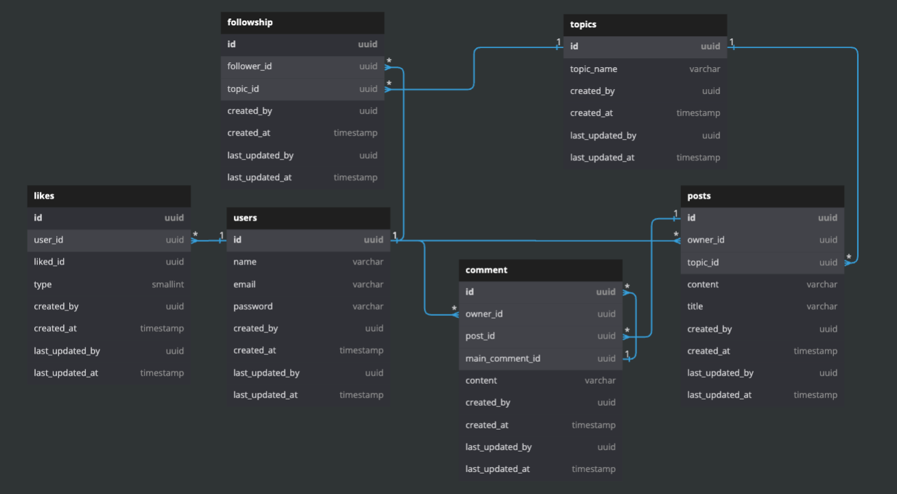

# GoCard

## Contents
- [Install golang-migration CLI](#install-golang-migration-cli-official-doc)
- [Install sqlc](#install-sqlc-official-doc)
- [Project init](#project-init)
    - [generate swagger api doc](#download-swag-by-using)
- [DB Schema](#db-schema)

## Install golang-migration CLI ([official doc](https://github.com/golang-migrate/migrate/tree/master/cmd/migrate))
### MacOS

```bash
$ brew install golang-migrate
```

### Linux (*.deb package)

```bash
$ curl -L https://packagecloud.io/golang-migrate/migrate/gpgkey | apt-key add -
$ echo "deb https://packagecloud.io/golang-migrate/migrate/ubuntu/ $(lsb_release -sc) main" > /etc/apt/sources.list.d/migrate.list
$ apt-get update
$ apt-get install -y migrate
```

### With Go toolchain

#### Versioned

```bash
$ go get -u -d github.com/golang-migrate/migrate/cmd/migrate
$ cd $GOPATH/src/github.com/golang-migrate/migrate/cmd/migrate
$ git checkout $TAG  # e.g. v4.1.0
$ # Go 1.16+
$ go install -tags 'postgres' github.com/golang-migrate/migrate/v4/cmd/migrate@$TAG
```
#### Unversioned

```bash
$ # Go 1.16+
$ go install -tags 'postgres' github.com/golang-migrate/migrate/v4/cmd/migrate@latest
```

## Install sqlc ([official doc](https://docs.sqlc.dev/en/stable/overview/install.html))

### MacOS

```bash
$ brew install sqlc
```

## Ubuntu

```
sudo snap install sqlc
```

## go install 

### Go >= 1.17:

```
go install github.com/kyleconroy/sqlc/cmd/sqlc@latest
```

### Go < 1.17:

```
go get github.com/kyleconroy/sqlc/cmd/sqlc
```

## project init
```
1. make postgres
2. make addplugin
3. make migrateup
4. go run .
```
### Download swag by using
```sh
$ go install github.com/swaggo/swag/cmd/swag@latest
```
### use Mac with zsh may need to export the GOPATH
```
# .zshrc file
export PATH=$(go env GOPATH)/bin:$PATH
```
### generate api doc
```sh
make swag
```

## DB Schema

